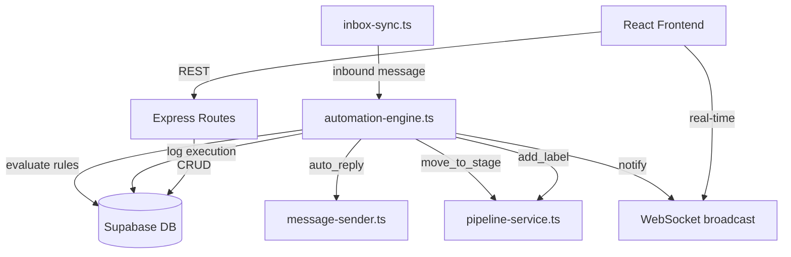
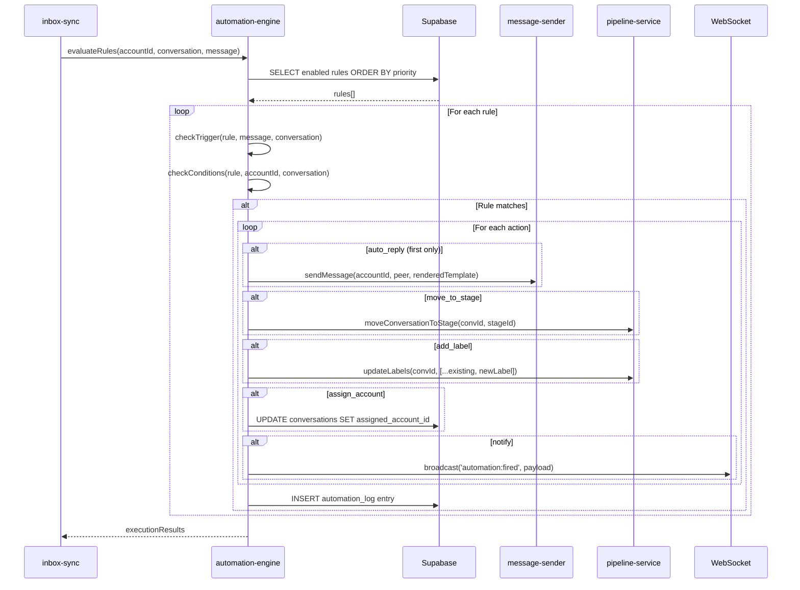
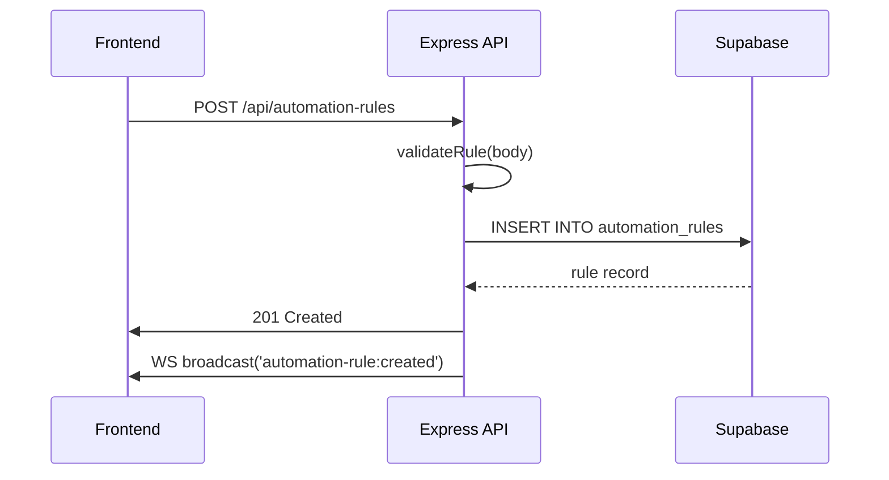

# Design Document: Automation Module

## Overview

The Automation Module adds an "if this, then that" rule engine for inbound TikTok DMs. When inbox-sync detects a new inbound message, the automation engine evaluates all enabled rules against it and executes matching actions (auto-reply, move to pipeline stage, add label, assign account, notify via WebSocket). Rules are configurable with trigger conditions, optional filters, priority ordering, and support multiple actions per rule. Only the first matching auto_reply fires to prevent spam.

This module integrates into the existing Express + TypeScript backend as a new service (`automation-engine.ts`), hooks into `inbox-sync.ts` after conversation upsert, and exposes REST endpoints for rule CRUD and log viewing. The frontend gets a new Automation page with rule management and execution log viewer.

## Architecture



## Sequence Diagrams

### Inbound Message → Rule Evaluation



### Rule CRUD Flow



## Components and Interfaces

### Component 1: AutomationEngine Service

**Purpose**: Core rule evaluation engine that processes inbound messages against configured rules and executes matching actions.

**Interface**:
```typescript
// server/services/automation-engine.ts

export interface AutomationTrigger {
  type: 'keyword' | 'any_message' | 'first_reply'
  keywords?: string[]  // required when type === 'keyword'
}

export interface AutomationConditions {
  accounts?: string[]  // filter: only fire for these account IDs
  labels?: string[]    // filter: only fire if conversation has these labels
}

export type AutomationActionType = 'auto_reply' | 'move_to_stage' | 'add_label' | 'assign_account' | 'notify'

export interface AutomationAction {
  type: AutomationActionType
  template?: string        // for auto_reply
  stage_id?: string        // for move_to_stage
  label?: string           // for add_label
  account_id?: string      // for assign_account
  message?: string         // for notify
}

export interface AutomationRule {
  id: string
  name: string
  enabled: boolean
  trigger: AutomationTrigger
  conditions: AutomationConditions
  actions: AutomationAction[]
  priority: number
  created_at: string
  updated_at: string
}

export interface AutomationLogEntry {
  id: string
  rule_id: string
  conversation_id: string
  trigger_type: string
  actions_taken: AutomationAction[]
  created_at: string
}

export interface ExecutionResult {
  rule_id: string
  rule_name: string
  actions_executed: AutomationActionType[]
}

export interface InboundMessageContext {
  account_id: string
  conversation_id: string
  peer_username: string
  peer_display_name: string | null
  message_text: string
  is_new_sender: boolean
  is_first_campaign_reply: boolean
  conversation_labels: string[]
}

// Core evaluation function
export async function evaluateRules(context: InboundMessageContext): Promise<ExecutionResult[]>

// Rule CRUD
export async function listRules(): Promise<AutomationRule[]>
export async function createRule(input: CreateRuleInput): Promise<AutomationRule>
export async function updateRule(id: string, input: UpdateRuleInput): Promise<AutomationRule>
export async function deleteRule(id: string): Promise<void>
export async function toggleRule(id: string): Promise<AutomationRule>

// Log queries
export async function getLog(options: { page?: number; per_page?: number }): Promise<PaginatedResult<AutomationLogEntry>>
```

**Responsibilities**:
- Load and cache enabled rules ordered by priority
- Match triggers against inbound message context
- Apply condition filters (account, labels)
- Execute actions in order, enforcing single auto_reply constraint
- Log all rule executions to automation_log table
- Validate rule structure on create/update

### Component 2: Rule Matching Logic

**Purpose**: Pure functions that determine whether a rule's trigger and conditions match a given message context.

```typescript
// Pure matching functions (no side effects)
export function matchesTrigger(trigger: AutomationTrigger, context: InboundMessageContext): boolean
export function matchesConditions(conditions: AutomationConditions, context: InboundMessageContext): boolean
export function matchesRule(rule: AutomationRule, context: InboundMessageContext): boolean
```

### Component 3: Action Executor

**Purpose**: Executes individual actions and handles errors gracefully (one action failing shouldn't prevent others from executing).

```typescript
export async function executeAction(
  action: AutomationAction,
  context: InboundMessageContext,
  options: { autoReplySent: boolean }
): Promise<{ executed: boolean; error?: string }>
```

## Data Models

### AutomationRule (Database)

```typescript
// automation_rules table
interface AutomationRuleRow {
  id: string              // uuid PK
  name: string            // text NOT NULL
  enabled: boolean        // boolean DEFAULT true
  trigger: {              // jsonb NOT NULL
    type: 'keyword' | 'any_message' | 'first_reply'
    keywords?: string[]
  }
  conditions: {           // jsonb DEFAULT '{}'
    accounts?: string[]
    labels?: string[]
  }
  actions: {              // jsonb NOT NULL
    type: AutomationActionType
    template?: string
    stage_id?: string
    label?: string
    account_id?: string
    message?: string
  }[]
  priority: number        // integer NOT NULL
  created_at: string      // timestamptz
  updated_at: string      // timestamptz
}
```

**Validation Rules**:
- `name` must be non-empty, max 100 characters
- `trigger.type` must be one of the three valid types
- `trigger.keywords` required and non-empty when type is 'keyword'
- `actions` must have at least one action
- Each action must have valid type-specific fields (e.g., `template` for auto_reply)
- `priority` must be a non-negative integer

### AutomationLog (Database)

```typescript
// automation_log table
interface AutomationLogRow {
  id: string              // uuid PK
  rule_id: string         // uuid FK → automation_rules(id) ON DELETE SET NULL
  conversation_id: string // uuid FK → conversations(id) ON DELETE CASCADE
  trigger_type: string    // text NOT NULL
  actions_taken: {        // jsonb NOT NULL
    type: AutomationActionType
    success: boolean
    error?: string
  }[]
  created_at: string      // timestamptz
}
```

## Key Functions with Formal Specifications

### Function 1: evaluateRules()

```typescript
async function evaluateRules(context: InboundMessageContext): Promise<ExecutionResult[]>
```

**Preconditions:**
- `context` is non-null with valid `account_id`, `conversation_id`, `message_text`
- `context.message_text` is a non-empty string
- Database connection is available

**Postconditions:**
- Returns array of ExecutionResult for all rules that matched and executed
- At most one `auto_reply` action is executed across all matching rules
- Rules are evaluated in priority order (lower number = higher priority)
- All executions are logged to automation_log
- Non-matching rules produce no side effects

**Loop Invariants:**
- `autoReplySent` flag is false initially and becomes true after first auto_reply execution
- All previously evaluated rules have been fully processed (actions executed + logged)

### Function 2: matchesTrigger()

```typescript
function matchesTrigger(trigger: AutomationTrigger, context: InboundMessageContext): boolean
```

**Preconditions:**
- `trigger` has a valid `type` field
- `context` has valid `message_text`, `is_new_sender`, `is_first_campaign_reply`

**Postconditions:**
- Returns `true` if and only if:
  - type='keyword': at least one keyword appears in message_text (case-insensitive)
  - type='any_message': context.is_new_sender is true
  - type='first_reply': context.is_first_campaign_reply is true
- No side effects, no mutations

### Function 3: matchesConditions()

```typescript
function matchesConditions(conditions: AutomationConditions, context: InboundMessageContext): boolean
```

**Preconditions:**
- `conditions` is a valid object (may be empty)
- `context` has valid `account_id` and `conversation_labels`

**Postconditions:**
- Returns `true` if ALL specified conditions are met:
  - If `conditions.accounts` is set: `context.account_id` must be in the list
  - If `conditions.labels` is set: conversation must have at least one matching label
- Empty conditions always return `true`
- No side effects

### Function 4: validateRule()

```typescript
function validateRule(input: CreateRuleInput | UpdateRuleInput): ValidationResult
```

**Preconditions:**
- `input` is a non-null object

**Postconditions:**
- Returns `{ valid: true }` if all validation rules pass
- Returns `{ valid: false, errors: string[] }` with specific error messages otherwise
- No side effects, no mutations

## Algorithmic Pseudocode

### Rule Evaluation Algorithm

```typescript
async function evaluateRules(context: InboundMessageContext): Promise<ExecutionResult[]> {
  // ASSERT: context is valid with non-empty message_text
  
  const rules = await loadEnabledRulesByPriority()
  const results: ExecutionResult[] = []
  let autoReplySent = false

  for (const rule of rules) {
    // INVARIANT: autoReplySent tracks whether any auto_reply has been sent
    // INVARIANT: all previous rules have been fully processed
    
    if (!matchesTrigger(rule.trigger, context)) continue
    if (!matchesConditions(rule.conditions, context)) continue

    // Rule matches — execute actions
    const actionsExecuted: AutomationActionType[] = []
    const actionResults: { type: AutomationActionType; success: boolean; error?: string }[] = []

    for (const action of rule.actions) {
      if (action.type === 'auto_reply' && autoReplySent) {
        // Skip — only first auto_reply wins
        continue
      }

      try {
        await executeAction(action, context)
        actionsExecuted.push(action.type)
        actionResults.push({ type: action.type, success: true })
        
        if (action.type === 'auto_reply') {
          autoReplySent = true
        }
      } catch (err) {
        actionResults.push({ type: action.type, success: false, error: err.message })
      }
    }

    // Log execution
    await logExecution(rule.id, context.conversation_id, rule.trigger.type, actionResults)
    
    results.push({
      rule_id: rule.id,
      rule_name: rule.name,
      actions_executed,
    })
  }

  // ASSERT: at most one auto_reply was sent
  // ASSERT: results contains entries for all matching rules
  return results
}
```

### Trigger Matching Algorithm

```typescript
function matchesTrigger(trigger: AutomationTrigger, context: InboundMessageContext): boolean {
  switch (trigger.type) {
    case 'keyword':
      // Case-insensitive OR match across keywords
      const messageLower = context.message_text.toLowerCase()
      return trigger.keywords!.some(kw => messageLower.includes(kw.toLowerCase()))
    
    case 'any_message':
      return context.is_new_sender
    
    case 'first_reply':
      return context.is_first_campaign_reply
    
    default:
      return false
  }
}
```

### Condition Filtering Algorithm

```typescript
function matchesConditions(conditions: AutomationConditions, context: InboundMessageContext): boolean {
  // Empty conditions = always match
  if (!conditions || Object.keys(conditions).length === 0) return true

  // Account filter: message must come from one of the specified accounts
  if (conditions.accounts && conditions.accounts.length > 0) {
    if (!conditions.accounts.includes(context.account_id)) return false
  }

  // Label filter: conversation must have at least one of the specified labels
  if (conditions.labels && conditions.labels.length > 0) {
    const hasMatch = conditions.labels.some(l => context.conversation_labels.includes(l))
    if (!hasMatch) return false
  }

  return true
}
```

## Example Usage

```typescript
// Integration point in inbox-sync.ts
import { evaluateRules, InboundMessageContext } from './automation-engine.js'

// After upserting conversation with unreadCount > 0:
const context: InboundMessageContext = {
  account_id: account.id,
  conversation_id: convRecord.id,
  peer_username: conv.peerUsername,
  peer_display_name: conv.peerDisplayName,
  message_text: conv.lastMessageText || '',
  is_new_sender: !existing,  // true if conversation was just created
  is_first_campaign_reply: campaignReplyDetected,
  conversation_labels: convRecord.labels || [],
}

const results = await evaluateRules(context)
if (results.length > 0) {
  console.log(`[automation] ${results.length} rules fired for ${conv.peerUsername}`)
}
```

```typescript
// Rule creation via API
const newRule: CreateRuleInput = {
  name: 'Welcome new leads',
  trigger: { type: 'any_message' },
  conditions: { accounts: ['account-uuid-1'] },
  actions: [
    { type: 'auto_reply', template: 'Hey {{username}}! Thanks for reaching out 🙌' },
    { type: 'move_to_stage', stage_id: 'stage-uuid-new' },
    { type: 'add_label', label: 'inbound' },
    { type: 'notify', message: 'New inbound lead: {{username}}' },
  ],
  priority: 0,
}
```

## Error Handling

### Error Scenario 1: Action Execution Failure

**Condition**: An individual action (e.g., move_to_stage with invalid stage_id) fails during execution
**Response**: Log the error in the action result, continue executing remaining actions for the rule
**Recovery**: The automation_log records which actions succeeded and which failed with error details

### Error Scenario 2: Database Unavailable During Evaluation

**Condition**: Supabase connection fails when loading rules
**Response**: Log error, return empty results (no rules fire), inbox-sync continues normally
**Recovery**: Next sync tick will retry rule evaluation

### Error Scenario 3: Invalid Rule Data in Database

**Condition**: A rule has malformed trigger/actions JSON (e.g., from manual DB edit)
**Response**: Skip the malformed rule, log a warning, continue evaluating remaining rules
**Recovery**: Admin can fix the rule via the UI or delete/recreate it

### Error Scenario 4: Template Rendering Failure

**Condition**: auto_reply template references unknown variables or rendering fails
**Response**: Skip the auto_reply action, log error, continue with other actions
**Recovery**: User edits the template in the rule configuration

## Testing Strategy

### Unit Testing Approach

- Test `matchesTrigger()` with all trigger types and edge cases (empty keywords, case variations)
- Test `matchesConditions()` with various filter combinations
- Test `validateRule()` with valid and invalid inputs
- Test action execution in isolation with mocked services

### Property-Based Testing Approach

**Property Test Library**: fast-check

- Rule matching is deterministic: same input always produces same match result
- Priority ordering is respected: if rule A has lower priority number than rule B, A is evaluated first
- Single auto_reply constraint: regardless of how many rules match, at most one auto_reply executes
- Condition filtering is conjunctive: all specified conditions must be met

### Integration Testing Approach

- End-to-end: create rule → simulate inbound message → verify actions executed and log created
- API endpoint testing: CRUD operations with validation error cases
- inbox-sync integration: verify automation engine is called after conversation upsert

## Performance Considerations

- Rules are loaded from DB on each evaluation (acceptable for <100 rules)
- If rule count grows large, add in-memory caching with invalidation on rule CRUD
- Automation evaluation is async and non-blocking to inbox-sync
- Log table should have a retention policy (e.g., 30 days) to prevent unbounded growth

## Security Considerations

- Template rendering must not allow code injection (only known variables are substituted)
- Rule creation requires authentication (same auth as all other endpoints)
- auto_reply rate limiting: the single-auto_reply-per-message constraint prevents spam loops
- Validate all action parameters (stage_id exists, account_id exists) before execution

## Dependencies

- Existing services: `message-sender.ts`, `pipeline-service.ts`, `template-renderer.ts`
- Existing utilities: `supabase.ts`, `async-handler.ts`
- Existing infrastructure: WebSocket broadcast from `index.ts`
- No new npm dependencies required

## Correctness Properties

*A property is a characteristic or behavior that should hold true across all valid executions of a system — essentially, a formal statement about what the system should do. Properties serve as the bridge between human-readable specifications and machine-verifiable correctness guarantees.*

### Property 1: Single Auto-Reply Constraint

For any set of enabled rules and any inbound message context, at most one `auto_reply` action is executed across all matching rules, regardless of how many rules contain auto_reply actions.

**Validates: Requirements 4.4**

### Property 2: Priority Ordering

For any two rules A and B where A.priority < B.priority, if both match the same message context, rule A's actions are executed before rule B's actions.

**Validates: Requirements 4.1, 4.3**

### Property 3: Keyword Matching is Case-Insensitive

For any keyword trigger rule and any message text, the trigger matches if and only if the message contains at least one keyword regardless of case (upper, lower, mixed).

**Validates: Requirements 1.1, 1.4, 1.5**

### Property 4: Empty Conditions Always Match

For any rule with empty conditions (no accounts filter, no labels filter), the conditions check always returns true regardless of the message context.

**Validates: Requirements 2.4**

### Property 5: Condition Conjunction

For any rule with both accounts and labels conditions specified, the rule matches only if BOTH conditions are satisfied (the account is in the list AND the conversation has a matching label).

**Validates: Requirements 2.1, 2.2, 2.3**

### Property 6: Disabled Rules Never Fire

For any rule where `enabled === false`, the rule never produces any execution results or side effects regardless of the message context.

**Validates: Requirements 4.2**

### Property 7: Action Resilience

For any rule with N actions where action K (K < N) throws an error, actions K+1 through N are still attempted and their results recorded.

**Validates: Requirements 5.1**

### Property 8: Rule Validation Round-Trip

For any valid CreateRuleInput that passes validation, creating the rule and then reading it back produces an equivalent rule (all fields preserved).

**Validates: Requirements 6.1**

### Property 9: Log Completeness

For any rule that fires (matches trigger + conditions), an automation_log entry is created containing the rule_id, conversation_id, trigger_type, and all actions attempted with their success/failure status.

**Validates: Requirements 7.1, 7.2**

### Property 10: Rule Validation Rejects Invalid Input

For any rule name that is empty or exceeds 100 characters, or any keyword trigger with an empty keywords array, or any rule with zero actions, validation SHALL return an error.

**Validates: Requirements 6.5, 6.6, 6.7**
