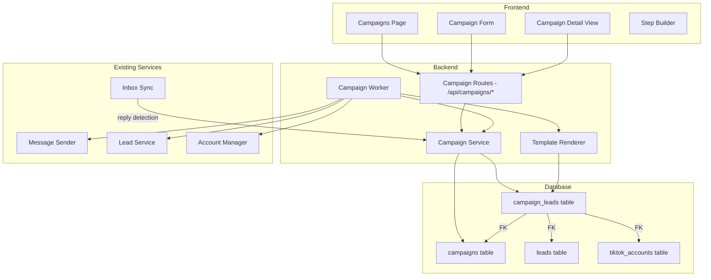
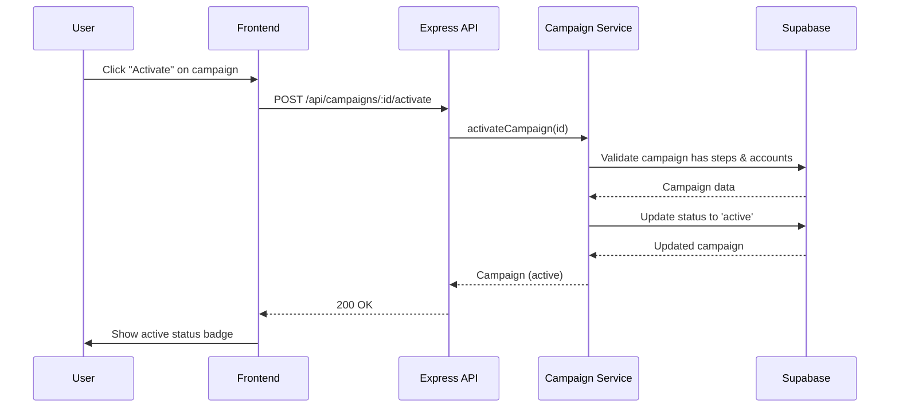
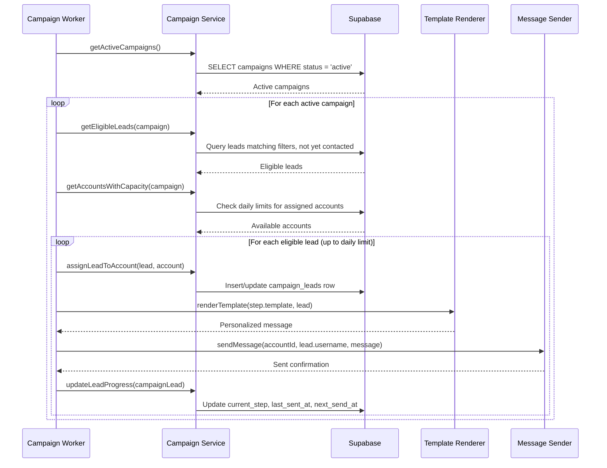
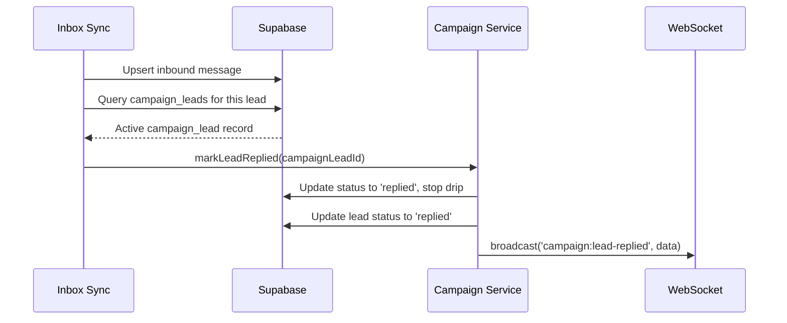

# Design Document: Campaign Engine

## Overview

The Campaign Engine is Phase 3 of the TokTik C2 platform, enabling automated outreach campaigns that pull leads from the Lead Engine and send templated DM sequences through assigned TikTok accounts. It introduces a background worker that processes active campaigns on a configurable interval, picking eligible leads, assigning them to accounts via round-robin distribution, and scheduling multi-step drip messages with randomized delays to appear human.

The system respects per-account daily DM limits, distributes load across multiple assigned accounts, supports personalization variables in message templates, and automatically stops the drip sequence when a lead replies. Campaign lifecycle management (draft → active → paused → completed → archived) provides full control over outreach operations.

The Campaign Engine follows the same architectural patterns established in Phases 1 and 2: Express service modules for business logic, Supabase for persistence, REST API endpoints consumed by a React frontend, and WebSocket broadcasts for real-time UI updates.

## Architecture



## Sequence Diagrams

### Campaign Activation Flow



### Campaign Worker Processing Cycle



### Reply Detection Flow



## Components and Interfaces

### Component 1: Campaign Service (`server/services/campaign-service.ts`)

**Purpose**: Core business logic for campaign CRUD, lead enrollment, progress tracking, and statistics.

**Interface**:
```typescript
interface CampaignService {
  createCampaign(input: CreateCampaignInput): Promise<Campaign>
  getCampaign(id: string): Promise<Campaign | null>
  getCampaignWithStats(id: string): Promise<CampaignWithStats | null>
  updateCampaign(id: string, fields: UpdateCampaignInput): Promise<Campaign>
  deleteCampaign(id: string): Promise<void>
  listCampaigns(): Promise<Campaign[]>
  activateCampaign(id: string): Promise<Campaign>
  pauseCampaign(id: string): Promise<Campaign>
  resumeCampaign(id: string): Promise<Campaign>
  getCampaignLeads(campaignId: string, filters?: CampaignLeadFilters): Promise<PaginatedResult<CampaignLead>>
  getStats(campaignId: string): Promise<CampaignStats>
}
```

**Responsibilities**:
- Campaign CRUD with status validation
- Status transitions (draft → active, active → paused, paused → active, active → completed)
- Campaign lead enrollment and progress tracking
- Statistics aggregation (sent, replied, converted counts)

### Component 2: Campaign Worker (`server/services/campaign-worker.ts`)

**Purpose**: Background worker that processes active campaigns on a configurable interval, picking eligible leads and scheduling sends.

**Interface**:
```typescript
interface CampaignWorker {
  start(): void
  stop(): void
  tick(): Promise<void>
}
```

**Responsibilities**:
- Run on configurable interval (default 60s)
- For each active campaign: find eligible leads, check account capacity
- Distribute leads across accounts via round-robin
- Schedule sends with randomized delays (60-300s between sends)
- Advance leads through drip steps based on delay_hours
- Mark campaigns as completed when all leads are processed

### Component 3: Template Renderer (`server/services/template-renderer.ts`)

**Purpose**: Renders message templates with personalization variables.

**Interface**:
```typescript
interface TemplateRenderer {
  render(template: string, variables: TemplateVariables): string
  getAvailableVariables(): string[]
  validate(template: string): TemplateValidationResult
}
```

**Responsibilities**:
- Replace `{{variable}}` placeholders with actual values
- Support variables: `{{username}}`, `{{display_name}}`
- Validate templates for unknown variables
- Return original placeholder text if variable value is missing

### Component 4: Campaign Routes (`server/index.ts` additions)

**Purpose**: Express route handlers exposing the Campaign API.

**Responsibilities**:
- Request validation and parameter parsing
- Delegating to Campaign Service
- WebSocket broadcasts on mutations
- Error responses with appropriate HTTP status codes

### Component 5: Campaigns Page (`frontend/src/pages/Campaigns.tsx`)

**Purpose**: Main UI for listing, creating, and managing campaigns.

**Responsibilities**:
- Campaign list with status badges and stats summary
- Create/edit form with step builder
- Campaign detail view with progress visualization
- Activate/pause/resume controls

## Data Models

### Campaign

```typescript
interface Campaign {
  id: string                          // uuid
  name: string                        // Campaign name
  status: CampaignStatus              // Current lifecycle status
  steps: CampaignStep[]               // Ordered drip sequence (JSONB)
  target_filters: LeadFilters         // Which leads to target (JSONB)
  assigned_account_ids: string[]      // TikTok accounts to send from
  daily_send_limit: number            // Max sends per day across all accounts
  created_at: string
  updated_at: string
}

type CampaignStatus = 'draft' | 'active' | 'paused' | 'completed' | 'archived'
```

**Validation Rules**:
- `name` must be non-empty, max 100 characters
- `steps` must have at least 1 step when activating
- `assigned_account_ids` must have at least 1 account when activating
- `daily_send_limit` must be positive integer, default 100
- Status transitions must follow allowed paths

### CampaignStep

```typescript
interface CampaignStep {
  step_number: number       // 1-indexed position in sequence
  delay_hours: number       // Hours to wait after previous step (0 = immediate)
  template: string          // Message template with {{variables}}
  skip_if_replied: boolean  // Stop drip if lead replied before this step
}
```

**Validation Rules**:
- `step_number` must be sequential starting from 1
- `delay_hours` must be >= 0
- `template` must be non-empty
- `skip_if_replied` defaults to true

### CampaignLead

```typescript
interface CampaignLead {
  id: string                          // uuid
  campaign_id: string                 // FK to campaigns
  lead_id: string                     // FK to leads
  account_id: string | null           // FK to tiktok_accounts (assigned sender)
  current_step: number                // Which step the lead is on (0 = not started)
  status: CampaignLeadStatus          // Progress status
  last_sent_at: string | null         // When last message was sent
  next_send_at: string | null         // When next message is due
  created_at: string
}

type CampaignLeadStatus = 'pending' | 'contacted' | 'replied' | 'converted' | 'skipped'
```

**Validation Rules**:
- `current_step` must be >= 0 and <= total steps in campaign
- `status` must be one of the defined enum values
- `next_send_at` is null when lead has completed all steps or replied

### CampaignStats

```typescript
interface CampaignStats {
  total_leads: number           // Total leads enrolled
  pending: number               // Not yet contacted
  contacted: number             // At least one message sent
  replied: number               // Lead replied
  converted: number             // Marked as converted
  skipped: number               // Skipped (e.g., do_not_contact)
  by_step: StepStats[]          // Breakdown per step
}

interface StepStats {
  step_number: number
  sent: number
  pending: number
}
```

### CreateCampaignInput

```typescript
interface CreateCampaignInput {
  name: string
  steps?: CampaignStep[]
  target_filters?: LeadFilters
  assigned_account_ids?: string[]
  daily_send_limit?: number
}
```

### UpdateCampaignInput

```typescript
interface UpdateCampaignInput {
  name?: string
  steps?: CampaignStep[]
  target_filters?: LeadFilters
  assigned_account_ids?: string[]
  daily_send_limit?: number
}
```

### TemplateVariables

```typescript
interface TemplateVariables {
  username: string
  display_name: string
}
```

### TemplateValidationResult

```typescript
interface TemplateValidationResult {
  valid: boolean
  unknownVariables: string[]
}
```

## Algorithmic Pseudocode

### Campaign Worker Tick

```typescript
async function tick(): Promise<void> {
  // Precondition: worker is running
  // Postcondition: all eligible leads for active campaigns have been processed or scheduled

  const activeCampaigns = await getActiveCampaigns()

  for (const campaign of activeCampaigns) {
    await processCampaign(campaign)
  }
}

async function processCampaign(campaign: Campaign): Promise<void> {
  // Step 1: Find leads that need action
  const leadsNeedingFirstContact = await getUncontactedLeads(campaign)
  const leadsDueForNextStep = await getLeadsDueForNextStep(campaign)
  const allActionableLeads = [...leadsNeedingFirstContact, ...leadsDueForNextStep]

  if (allActionableLeads.length === 0) {
    // Check if campaign is complete (all leads processed)
    await checkCampaignCompletion(campaign)
    return
  }

  // Step 2: Get accounts with remaining daily capacity
  const accountCapacities = await getAccountCapacities(campaign.assigned_account_ids)
  const availableAccounts = accountCapacities.filter(a => a.remaining > 0)

  if (availableAccounts.length === 0) return // All accounts at limit

  // Step 3: Distribute leads across accounts (round-robin)
  let accountIndex = 0
  let totalSentThisTick = 0
  const maxPerTick = campaign.daily_send_limit

  for (const actionableLead of allActionableLeads) {
    if (totalSentThisTick >= maxPerTick) break

    // Find next account with capacity
    let attempts = 0
    while (availableAccounts[accountIndex].remaining <= 0 && attempts < availableAccounts.length) {
      accountIndex = (accountIndex + 1) % availableAccounts.length
      attempts++
    }
    if (attempts >= availableAccounts.length) break // No capacity left

    const account = availableAccounts[accountIndex]

    // Step 4: Determine which step to send
    const stepToSend = actionableLead.current_step + 1
    const step = campaign.steps[stepToSend - 1]

    // Step 5: Check skip_if_replied
    if (step.skip_if_replied && actionableLead.status === 'replied') {
      await markLeadSkipped(actionableLead)
      continue
    }

    // Step 6: Render template and send
    const variables = await getLeadVariables(actionableLead.lead_id)
    const message = renderTemplate(step.template, variables)

    // Step 7: Schedule with randomized delay
    const delayMs = randomDelay(60_000, 300_000)
    await sleep(delayMs)

    await sendMessage(account.id, variables.username, message)

    // Step 8: Update progress
    await updateLeadProgress(actionableLead, stepToSend, campaign.steps.length)

    account.remaining--
    totalSentThisTick++
    accountIndex = (accountIndex + 1) % availableAccounts.length
  }
}
```

### Lead Eligibility Query

```typescript
async function getUncontactedLeads(campaign: Campaign): Promise<CampaignLead[]> {
  // Precondition: campaign is active
  // Postcondition: returns leads matching target_filters not yet in campaign_leads

  // Step 1: Get leads matching campaign's target filters
  const matchingLeads = await queryLeadsByFilters(campaign.target_filters)

  // Step 2: Exclude leads already in this campaign
  const existingLeadIds = await getCampaignLeadIds(campaign.id)
  const newLeads = matchingLeads.filter(l => !existingLeadIds.has(l.id))

  // Step 3: Exclude leads with status 'do_not_contact'
  const eligibleLeads = newLeads.filter(l => l.status !== 'do_not_contact')

  // Step 4: Create campaign_lead records for new leads
  const campaignLeads = await enrollLeads(campaign.id, eligibleLeads)

  return campaignLeads
}

async function getLeadsDueForNextStep(campaign: Campaign): Promise<CampaignLead[]> {
  // Precondition: campaign is active
  // Postcondition: returns campaign_leads where next_send_at <= now() and status is 'contacted'

  return await supabase
    .from('campaign_leads')
    .select('*')
    .eq('campaign_id', campaign.id)
    .eq('status', 'contacted')
    .lte('next_send_at', new Date().toISOString())
    .order('next_send_at', { ascending: true })
}
```

### Template Rendering

```typescript
function renderTemplate(template: string, variables: TemplateVariables): string {
  // Precondition: template is a non-empty string
  // Postcondition: all known {{variable}} placeholders are replaced with values

  const KNOWN_VARIABLES = ['username', 'display_name']

  return template.replace(/\{\{(\w+)\}\}/g, (match, varName) => {
    if (varName in variables && variables[varName]) {
      return variables[varName]
    }
    return match // Leave unknown/empty variables as-is
  })
}

function validateTemplate(template: string): TemplateValidationResult {
  // Precondition: template is a string
  // Postcondition: returns validation result with list of unknown variables

  const KNOWN_VARIABLES = new Set(['username', 'display_name'])
  const found = template.match(/\{\{(\w+)\}\}/g) || []
  const unknownVariables = found
    .map(m => m.slice(2, -2))
    .filter(v => !KNOWN_VARIABLES.has(v))

  return {
    valid: unknownVariables.length === 0,
    unknownVariables: [...new Set(unknownVariables)],
  }
}
```

### Account Capacity Calculation

```typescript
async function getAccountCapacities(
  accountIds: string[]
): Promise<Array<{ id: string; remaining: number }>> {
  // Precondition: accountIds is non-empty array of valid UUIDs
  // Postcondition: each account has remaining = daily_dm_limit - dms_sent_today

  const accounts = await supabase
    .from('tiktok_accounts')
    .select('id, daily_dm_limit, dms_sent_today, status, cooldown_until')
    .in('id', accountIds)

  return accounts
    .filter(a => a.status === 'connected' && !isInCooldown(a.cooldown_until))
    .map(a => ({
      id: a.id,
      remaining: Math.max(0, a.daily_dm_limit - a.dms_sent_today),
    }))
}
```

### Randomized Delay

```typescript
function randomDelay(minMs: number, maxMs: number): number {
  // Precondition: minMs >= 0, maxMs >= minMs
  // Postcondition: result is in [minMs, maxMs]
  return Math.floor(Math.random() * (maxMs - minMs + 1)) + minMs
}
```

## Key Functions with Formal Specifications

### `renderTemplate(template: string, variables: TemplateVariables): string`

**Preconditions:**
- `template` is a non-empty string
- `variables` is a valid TemplateVariables object

**Postconditions:**
- All `{{username}}` occurrences replaced with `variables.username`
- All `{{display_name}}` occurrences replaced with `variables.display_name`
- Unknown variables (not in known set) remain as literal `{{varName}}` text
- If a known variable's value is empty/null, the placeholder remains unchanged
- No other text in the template is modified

**Loop Invariants:** N/A (single regex replace pass)

### `validateTemplate(template: string): TemplateValidationResult`

**Preconditions:**
- `template` is a string (may be empty)

**Postconditions:**
- `result.valid === true` if and only if all `{{...}}` placeholders use known variable names
- `result.unknownVariables` contains each unknown variable name exactly once
- Known variables: `username`, `display_name`

### `processCampaign(campaign: Campaign): Promise<void>`

**Preconditions:**
- `campaign.status === 'active'`
- `campaign.steps.length >= 1`
- `campaign.assigned_account_ids.length >= 1`

**Postconditions:**
- All eligible leads have been processed or scheduled
- No account exceeds its daily DM limit
- Each send has a randomized delay between 60-300 seconds
- Leads that replied are not advanced to next step
- Campaign marked as completed if all leads are fully processed

**Loop Invariants:**
- `totalSentThisTick <= campaign.daily_send_limit`
- Each account's `remaining` count is non-negative
- `accountIndex` cycles through available accounts round-robin

### `getUncontactedLeads(campaign: Campaign): Promise<CampaignLead[]>`

**Preconditions:**
- `campaign` is a valid active campaign with target_filters

**Postconditions:**
- Returned leads match campaign's target_filters
- No returned lead is already enrolled in this campaign
- No returned lead has status 'do_not_contact'
- All returned leads have been enrolled in campaign_leads with status 'pending'

### `getAccountCapacities(accountIds: string[]): Promise<Array<{id, remaining}>>`

**Preconditions:**
- `accountIds` is a non-empty array of valid UUIDs

**Postconditions:**
- Only connected accounts not in cooldown are returned
- `remaining = max(0, daily_dm_limit - dms_sent_today)` for each account
- Accounts in cooldown or disconnected are excluded

### `randomDelay(minMs: number, maxMs: number): number`

**Preconditions:**
- `minMs >= 0`
- `maxMs >= minMs`

**Postconditions:**
- Result is an integer in the range `[minMs, maxMs]`

## Example Usage

```typescript
// Create a campaign
const campaign = await createCampaign({
  name: 'January Fitness Outreach',
  steps: [
    {
      step_number: 1,
      delay_hours: 0,
      template: 'Hey {{username}}! I saw your fitness content and loved it. Would you be open to a collab?',
      skip_if_replied: true,
    },
    {
      step_number: 2,
      delay_hours: 48,
      template: 'Hi {{display_name}}, just following up on my last message. Let me know if you are interested!',
      skip_if_replied: true,
    },
  ],
  target_filters: { status: 'new', tags: ['fitness'] },
  assigned_account_ids: ['account-uuid-1', 'account-uuid-2'],
  daily_send_limit: 100,
})

// Activate the campaign
await activateCampaign(campaign.id)

// Template rendering
const message = renderTemplate(
  'Hey {{username}}! I saw your content and...',
  { username: 'fitness_guru', display_name: 'Fitness Guru' }
)
// Result: "Hey fitness_guru! I saw your content and..."

// Template validation
const validation = validateTemplate('Hey {{username}}, check out {{unknown_var}}!')
// Result: { valid: false, unknownVariables: ['unknown_var'] }

// Get campaign stats
const stats = await getStats(campaign.id)
// Result: { total_leads: 150, pending: 80, contacted: 50, replied: 15, converted: 3, skipped: 2, by_step: [...] }

// Get campaign leads with progress
const leads = await getCampaignLeads(campaign.id, { status: 'contacted', page: 1, per_page: 50 })
```

## Error Handling

### Error Scenario 1: Activation Without Steps or Accounts

**Condition**: User attempts to activate a campaign with no steps defined or no accounts assigned
**Response**: Return 400 Bad Request with message indicating what's missing
**Recovery**: User adds steps/accounts via the edit form, then retries activation

### Error Scenario 2: Account Reaches Daily Limit During Processing

**Condition**: An assigned account hits its daily DM limit mid-processing
**Response**: Worker skips that account for the remainder of the tick, distributes to other accounts
**Recovery**: Account limit resets next day; worker continues with remaining accounts

### Error Scenario 3: Account Enters Cooldown During Processing

**Condition**: A send triggers a rate-limit response from TikTok, putting the account in cooldown
**Response**: Worker marks the account as unavailable, does not retry the failed send, continues with other accounts
**Recovery**: Account exits cooldown after backoff period; worker picks it up in future ticks

### Error Scenario 4: Lead Becomes 'do_not_contact' After Enrollment

**Condition**: A lead's status changes to 'do_not_contact' while enrolled in an active campaign
**Response**: Worker checks lead status before each send; skips leads marked 'do_not_contact'
**Recovery**: Campaign lead record updated to 'skipped' status

### Error Scenario 5: Campaign Deleted While Active

**Condition**: User deletes a campaign that is currently active
**Response**: Campaign status set to 'archived', worker stops processing it on next tick
**Recovery**: No further messages sent; campaign_leads records preserved for audit

### Error Scenario 6: Transport Send Failure

**Condition**: Message send fails due to transport error (browser crash, network issue)
**Response**: Log the error, do not advance the lead's step, leave next_send_at unchanged for retry
**Recovery**: Worker retries on next tick; if persistent, account may enter cooldown

## Testing Strategy

### Unit Testing Approach

- Test `renderTemplate` with various variable combinations and edge cases
- Test `validateTemplate` with valid/invalid templates
- Test campaign status transition logic (allowed/disallowed transitions)
- Test account capacity calculation with various limit/sent combinations
- Test lead eligibility filtering logic
- Test round-robin distribution algorithm

### Property-Based Testing Approach

**Property Test Library**: fast-check

Property-based tests will validate:
- Template rendering preserves non-variable text
- Template rendering is idempotent for known variables
- Round-robin distribution is fair across accounts
- Campaign lead status transitions are valid
- Randomized delays are within bounds

### Integration Testing Approach

- Full API endpoint tests for campaign CRUD
- Worker tick processing with mock message sender
- Reply detection updating campaign_lead status
- Campaign completion detection
- Concurrent campaign processing

## Performance Considerations

- **Worker interval**: Default 60s prevents excessive database polling while maintaining responsiveness
- **Batch queries**: Worker fetches all active campaigns and their leads in batched queries, not per-lead
- **Randomized delays**: 60-300s between sends means a single tick may take several minutes for large batches; worker processes sequentially within a campaign to respect delays
- **Index on next_send_at**: B-tree index on `campaign_leads.next_send_at` for efficient "due for next step" queries
- **Campaign completion check**: Only runs when no actionable leads found, avoiding unnecessary queries each tick

## Security Considerations

- **Auth middleware**: All campaign endpoints require bearer token auth (same as existing endpoints)
- **Account validation**: Campaign can only use accounts that exist and belong to the operator
- **Template injection**: Template variables are plain text replacement only — no code execution
- **Rate limiting**: Worker respects per-account daily limits and global campaign daily_send_limit
- **Cooldown respect**: Worker never sends through accounts in cooldown state

## Dependencies

- **Existing**: Supabase client, Express, WebSocket (`ws`), message-sender service, lead-service, account-manager, cooldown utility
- **New backend**: None — worker uses `setInterval` (same pattern as inbox-sync)
- **New frontend**: None — uses existing React + Tailwind + lucide-react patterns

## Correctness Properties

*A property is a characteristic or behavior that should hold true across all valid executions of a system — essentially, a formal statement about what the system should do. Properties serve as the bridge between human-readable specifications and machine-verifiable correctness guarantees.*

### Property 1: Template rendering preserves non-variable text

*For any* template string and any valid TemplateVariables, all characters in the template that are not part of a `{{variable}}` placeholder remain unchanged in the output.

**Validates: Requirements 4.5**

### Property 2: Template rendering idempotence for resolved variables

*For any* template string where all `{{variable}}` placeholders reference known variables with non-empty values, rendering the template once produces the same result as rendering it twice (the output contains no remaining placeholders to resolve).

**Validates: Requirements 4.1, 4.2**

### Property 3: Template validation detects all unknown variables

*For any* template string containing `{{variable}}` placeholders, `validateTemplate` returns `valid: false` if and only if at least one placeholder references a variable not in the known set (`username`, `display_name`).

**Validates: Requirements 4.6, 4.7**

### Property 4: Randomized delay is within bounds

*For any* minMs and maxMs where `0 <= minMs <= maxMs`, `randomDelay(minMs, maxMs)` always returns a value in the range `[minMs, maxMs]`.

**Validates: Requirements 5.6**

### Property 5: Round-robin distribution fairness

*For any* set of N accounts with equal remaining capacity and M leads to distribute (where M >= N), the difference in assignments between any two accounts is at most 1.

**Validates: Requirements 9.1**

### Property 6: Campaign status transitions are valid

*For any* campaign, only the following status transitions are allowed: draft→active, active→paused, paused→active, active→completed, any→archived. All other transitions are rejected.

**Validates: Requirements 3.6, 3.7**

### Property 7: Daily send limit is never exceeded

*For any* campaign processing tick, the total number of messages sent across all accounts for a campaign never exceeds the campaign's `daily_send_limit`.

**Validates: Requirements 6.1**

### Property 8: Replied leads are never advanced

*For any* campaign lead with status 'replied', the worker never sends additional messages to that lead regardless of remaining steps.

**Validates: Requirements 7.4, 7.5**

### Property 9: Do-not-contact leads are never enrolled or messaged

*For any* set of leads being considered for campaign enrollment, no lead with status 'do_not_contact' is enrolled, and any previously-enrolled lead whose status changes to 'do_not_contact' is skipped on subsequent processing.

**Validates: Requirements 14.1, 14.2**

### Property 10: Per-account daily limit is never exceeded

*For any* account used in campaign processing, the number of messages sent through that account in a single tick never causes `dms_sent_today` to exceed `daily_dm_limit`.

**Validates: Requirements 6.2, 6.3**
