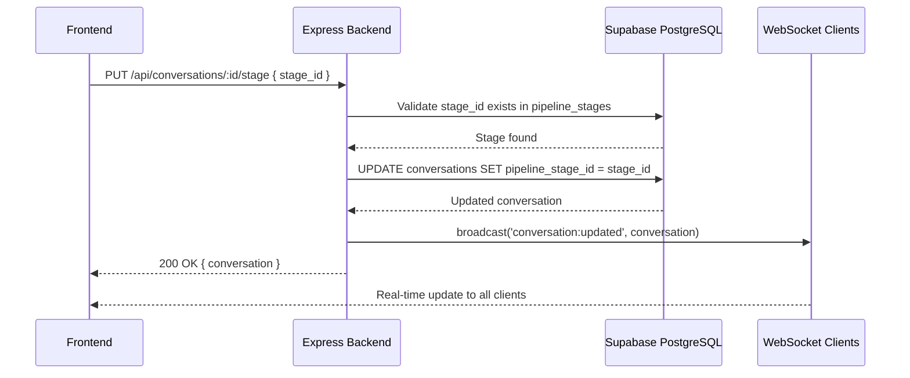
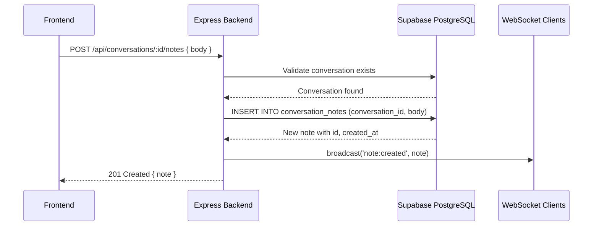
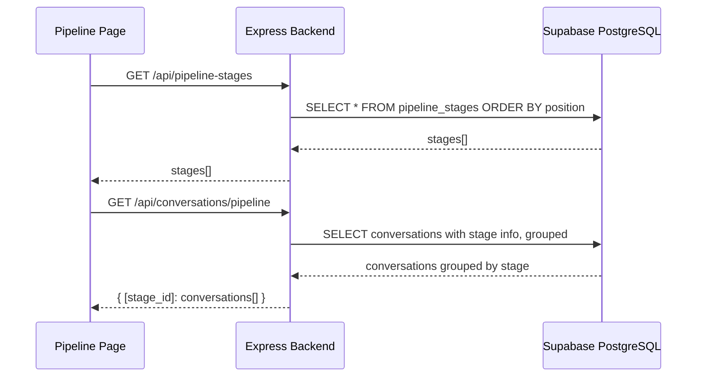

# Design Document: CRM Module

## Overview

The CRM Module transforms the TokTik C2 unified inbox from a message viewer into a workflow management tool. It introduces pipeline stages (a configurable sales/outreach funnel), timestamped conversation notes, and enhanced label management — enabling operators to track conversations through lifecycle stages, annotate context, and filter/organize at scale.

The module adds a kanban-style Pipeline page, enhances the existing Unibox right pane with notes and stage selection, and provides pipeline statistics for conversion tracking. It builds on the existing `conversations` table (which already has a `labels text[]` column) and adds two new tables (`pipeline_stages`, `conversation_notes`) plus a foreign key column on `conversations`.

## Architecture

```mermaid
graph TD
    subgraph Frontend
        PipelinePage[Pipeline Page - Kanban Board]
        UniboxEnhanced[Enhanced Unibox Right Pane]
        Sidebar[Sidebar - New Pipeline Link]
    end

    subgraph Backend
        PipelineStageRoutes[Pipeline Stage Routes]
        ConversationRoutes[Conversation Routes - Enhanced]
        NoteRoutes[Note Routes]
        StatsRoutes[Pipeline Stats Routes]
        PipelineService[pipeline-service.ts]
        NoteService[note-service.ts]
    end

    subgraph Database
        PipelineStagesTable[pipeline_stages]
        ConversationNotesTable[conversation_notes]
        ConversationsTable[conversations + pipeline_stage_id]
    end

    PipelinePage --> PipelineStageRoutes
    PipelinePage --> ConversationRoutes
    UniboxEnhanced --> NoteRoutes
    UniboxEnhanced --> PipelineStageRoutes
    UniboxEnhanced --> ConversationRoutes

    PipelineStageRoutes --> PipelineService
    ConversationRoutes --> PipelineService
    NoteRoutes --> NoteService
    StatsRoutes --> PipelineService

    PipelineService --> PipelineStagesTable
    PipelineService --> ConversationsTable
    NoteService --> ConversationNotesTable
end
```

## Sequence Diagrams

### Move Conversation to Pipeline Stage



### Add Note to Conversation



### Pipeline Kanban Load



## Components and Interfaces

### Component 1: PipelineService (Backend)

**Purpose**: Manages pipeline stages CRUD, conversation stage assignment, and pipeline statistics computation.

**Interface**:
```typescript
interface PipelineService {
  listStages(): Promise<PipelineStage[]>
  createStage(input: CreateStageInput): Promise<PipelineStage>
  updateStage(id: string, input: UpdateStageInput): Promise<PipelineStage>
  deleteStage(id: string): Promise<void>
  moveConversationToStage(conversationId: string, stageId: string | null): Promise<Conversation>
  getConversationsByPipeline(filters?: PipelineFilters): Promise<PipelineGroupedConversations>
  getStats(): Promise<PipelineStats>
}
```

**Responsibilities**:
- CRUD operations for pipeline stages with position ordering
- Validate stage existence before assignment
- Nullify conversation stage references when a stage is deleted
- Compute per-stage counts, conversion rates, and average time metrics

### Component 2: NoteService (Backend)

**Purpose**: Manages conversation notes — create, list, delete.

**Interface**:
```typescript
interface NoteService {
  listNotes(conversationId: string): Promise<ConversationNote[]>
  createNote(conversationId: string, body: string): Promise<ConversationNote>
  deleteNote(noteId: string): Promise<void>
}
```

**Responsibilities**:
- Validate conversation existence before creating notes
- Return notes ordered by created_at ascending (chronological)
- Cascade delete handled by database FK constraint

### Component 3: Pipeline Page (Frontend)

**Purpose**: Kanban board view showing conversations grouped by pipeline stage with drag-and-drop.

**Responsibilities**:
- Fetch stages and conversations on mount
- Render columns per stage (plus an "Unassigned" column)
- Support drag-and-drop to move conversations between stages
- Display conversation cards with: peer name, account badge, last message preview, labels, time in stage
- Real-time updates via WebSocket

### Component 4: Enhanced Unibox Right Pane (Frontend)

**Purpose**: Extends the existing message thread view with notes, stage selector, and label management.

**Responsibilities**:
- Interleave notes with messages by timestamp
- Pipeline stage dropdown selector
- Label chips with add/remove capability
- Quick actions bar (archive, move stage, add note)

## Data Models

### PipelineStage

```typescript
interface PipelineStage {
  id: string           // uuid
  name: string         // e.g., "New", "Interested", "Negotiating"
  position: number     // ordering index (0-based)
  color: string        // hex color for UI display, e.g., "#3b82f6"
  created_at: string   // ISO timestamp
}

interface CreateStageInput {
  name: string
  color?: string       // defaults to a generated color
  position?: number    // defaults to max(position) + 1
}

interface UpdateStageInput {
  name?: string
  color?: string
  position?: number
}
```

**Validation Rules**:
- `name` must be non-empty, max 50 characters, unique across stages
- `position` must be >= 0
- `color` must be a valid hex color string (e.g., "#ff0000" or "#f00")

### ConversationNote

```typescript
interface ConversationNote {
  id: string              // uuid
  conversation_id: string // FK to conversations
  body: string            // note text content
  created_at: string      // ISO timestamp
}

interface CreateNoteInput {
  body: string
}
```

**Validation Rules**:
- `body` must be non-empty, max 2000 characters
- `conversation_id` must reference an existing conversation

### Enhanced Conversation (extended)

```typescript
interface Conversation {
  id: string
  account_id: string
  peer_username: string
  peer_display_name: string | null
  peer_avatar: string | null
  last_message_text: string | null
  last_message_at: string | null
  last_message_direction: string | null
  unread_count: number
  archived: boolean
  labels: string[]
  pipeline_stage_id: string | null  // NEW: FK to pipeline_stages
  created_at: string
}
```

### PipelineGroupedConversations

```typescript
interface PipelineGroupedConversations {
  unassigned: Conversation[]
  stages: {
    stage: PipelineStage
    conversations: Conversation[]
  }[]
}
```

### PipelineStats

```typescript
interface PipelineStats {
  total_conversations: number
  unassigned_count: number
  per_stage: {
    stage_id: string
    stage_name: string
    count: number
    avg_time_in_stage_hours: number | null
  }[]
  conversion_rates: {
    from_stage: string
    to_stage: string
    rate: number  // 0-1 decimal
  }[]
}
```

## Key Functions with Formal Specifications

### Function: moveConversationToStage()

```typescript
async function moveConversationToStage(
  conversationId: string,
  stageId: string | null
): Promise<Conversation>
```

**Preconditions:**
- `conversationId` references an existing conversation
- `stageId` is either null (unassign) or references an existing pipeline_stage

**Postconditions:**
- The conversation's `pipeline_stage_id` is updated to `stageId`
- A WebSocket broadcast is emitted with the updated conversation
- If `stageId` is null, the conversation is unassigned from any stage
- The conversation's other fields remain unchanged

**Loop Invariants:** N/A

### Function: deleteStage()

```typescript
async function deleteStage(id: string): Promise<void>
```

**Preconditions:**
- `id` references an existing pipeline_stage

**Postconditions:**
- The stage row is deleted from `pipeline_stages`
- All conversations with `pipeline_stage_id = id` are updated to `pipeline_stage_id = null`
- Remaining stages maintain valid position ordering (no gaps)

**Loop Invariants:** N/A

### Function: updateStagePositions()

```typescript
async function updateStage(id: string, input: UpdateStageInput): Promise<PipelineStage>
```

**Preconditions:**
- `id` references an existing pipeline_stage
- If `input.position` is provided, it is >= 0 and <= max existing position
- If `input.name` is provided, it is non-empty and unique

**Postconditions:**
- The stage is updated with the provided fields
- If position changed, other stages are reordered to maintain contiguous positions
- No two stages share the same position value

**Loop Invariants:**
- After reordering: for all stages, positions form a contiguous sequence [0, 1, 2, ..., n-1]

### Function: getStats()

```typescript
async function getStats(): Promise<PipelineStats>
```

**Preconditions:**
- Pipeline stages table exists (may be empty)

**Postconditions:**
- `total_conversations` equals the count of all non-archived conversations
- `unassigned_count` equals conversations where `pipeline_stage_id IS NULL`
- Sum of all `per_stage[].count` + `unassigned_count` equals `total_conversations`
- Each `conversion_rate` is between 0 and 1 inclusive
- `avg_time_in_stage_hours` is null if no conversations have transitioned out of that stage

**Loop Invariants:** N/A

### Function: updateLabels()

```typescript
async function updateLabels(
  conversationId: string,
  labels: string[]
): Promise<Conversation>
```

**Preconditions:**
- `conversationId` references an existing conversation
- `labels` is an array of strings (may be empty)
- Each label is non-empty and max 50 characters

**Postconditions:**
- The conversation's `labels` field is replaced with the provided array
- Duplicate labels are removed (set semantics)
- A WebSocket broadcast is emitted with the updated conversation

**Loop Invariants:** N/A

## Algorithmic Pseudocode

### Pipeline Stats Computation

```typescript
async function computePipelineStats(): Promise<PipelineStats> {
  // Step 1: Get all stages ordered by position
  const stages = await listStages()
  
  // Step 2: Count conversations per stage
  const totalConversations = await countConversations({ archived: false })
  const unassignedCount = await countConversations({ 
    archived: false, 
    pipeline_stage_id: null 
  })
  
  const perStage: PipelineStats['per_stage'] = []
  for (const stage of stages) {
    const count = await countConversations({ 
      archived: false, 
      pipeline_stage_id: stage.id 
    })
    
    // Average time: look at conversations that have moved OUT of this stage
    const avgTime = await computeAvgTimeInStage(stage.id)
    
    perStage.push({
      stage_id: stage.id,
      stage_name: stage.name,
      count,
      avg_time_in_stage_hours: avgTime,
    })
  }
  
  // Step 3: Compute conversion rates between adjacent stages
  const conversionRates: PipelineStats['conversion_rates'] = []
  for (let i = 0; i < stages.length - 1; i++) {
    const fromStage = stages[i]
    const toStage = stages[i + 1]
    
    // Rate = conversations that reached toStage / conversations that reached fromStage
    const reachedFrom = await countConversationsEverInStage(fromStage.id)
    const reachedTo = await countConversationsEverInStage(toStage.id)
    
    const rate = reachedFrom > 0 ? reachedTo / reachedFrom : 0
    conversionRates.push({
      from_stage: fromStage.name,
      to_stage: toStage.name,
      rate: Math.min(1, Math.max(0, rate)),
    })
  }
  
  return { total_conversations: totalConversations, unassigned_count: unassignedCount, per_stage: perStage, conversion_rates: conversionRates }
}
```

### Stage Reordering on Position Update

```typescript
async function reorderStages(
  movedStageId: string, 
  newPosition: number
): Promise<void> {
  const stages = await listStages() // ordered by position
  const currentIndex = stages.findIndex(s => s.id === movedStageId)
  
  if (currentIndex === -1) throw new Error('Stage not found')
  if (newPosition === stages[currentIndex].position) return // no-op
  
  // Remove from current position and insert at new position
  const [moved] = stages.splice(currentIndex, 1)
  stages.splice(newPosition, 0, moved)
  
  // Reassign positions to maintain contiguous sequence
  // Invariant: after loop, positions are [0, 1, 2, ..., n-1]
  for (let i = 0; i < stages.length; i++) {
    if (stages[i].position !== i) {
      await updateStagePosition(stages[i].id, i)
    }
  }
}
```

## Example Usage

```typescript
// Example 1: Create pipeline stages
const stages = [
  await pipelineService.createStage({ name: 'New', color: '#6b7280' }),
  await pipelineService.createStage({ name: 'Interested', color: '#3b82f6' }),
  await pipelineService.createStage({ name: 'Negotiating', color: '#f59e0b' }),
  await pipelineService.createStage({ name: 'Closed Won', color: '#10b981' }),
  await pipelineService.createStage({ name: 'Closed Lost', color: '#ef4444' }),
]

// Example 2: Move a conversation to "Interested" stage
const updated = await pipelineService.moveConversationToStage(
  'conv-uuid-123',
  stages[1].id
)
// updated.pipeline_stage_id === stages[1].id

// Example 3: Add a note to a conversation
const note = await noteService.createNote(
  'conv-uuid-123',
  'Offered 20% discount, follow up next week'
)
// note.id, note.created_at populated

// Example 4: Update labels on a conversation
const conv = await updateLabels('conv-uuid-123', ['vip', 'hot-lead', 'discount-offered'])
// conv.labels === ['vip', 'hot-lead', 'discount-offered']

// Example 5: Get pipeline stats
const stats = await pipelineService.getStats()
// stats.total_conversations === 150
// stats.per_stage[0] === { stage_name: 'New', count: 45, avg_time_in_stage_hours: 12.5 }
// stats.conversion_rates[0] === { from_stage: 'New', to_stage: 'Interested', rate: 0.67 }

// Example 6: Load kanban view
const kanban = await pipelineService.getConversationsByPipeline()
// kanban.unassigned === [...conversations without stage]
// kanban.stages[0].conversations === [...conversations in "New" stage]
```

## Error Handling

### Error Scenario 1: Move to Non-Existent Stage

**Condition**: `stageId` provided to `moveConversationToStage` does not exist in `pipeline_stages`
**Response**: Return 404 with `{ error: "Pipeline stage not found" }`
**Recovery**: Client shows error toast, conversation remains in current stage

### Error Scenario 2: Delete Stage with Conversations

**Condition**: Stage being deleted has conversations assigned to it
**Response**: Nullify `pipeline_stage_id` on all affected conversations, then delete the stage. Return 200.
**Recovery**: Conversations appear in "Unassigned" column on kanban board

### Error Scenario 3: Duplicate Stage Name

**Condition**: Creating or updating a stage with a name that already exists
**Response**: Return 409 with `{ error: "Stage name already exists" }`
**Recovery**: Client shows validation error, user picks a different name

### Error Scenario 4: Note on Non-Existent Conversation

**Condition**: `conversationId` does not exist when creating a note
**Response**: Return 404 with `{ error: "Conversation not found" }`
**Recovery**: Client shows error toast

### Error Scenario 5: Invalid Label Format

**Condition**: Label string is empty or exceeds 50 characters
**Response**: Return 400 with `{ error: "Each label must be 1-50 characters" }`
**Recovery**: Client shows validation error on the label input

## Testing Strategy

### Unit Testing Approach

- Test `PipelineService` methods with mocked Supabase client
- Test stage position reordering logic in isolation
- Test label deduplication and validation
- Test stats computation with known data sets
- Test note CRUD operations

### Property-Based Testing Approach

**Property Test Library**: fast-check

Property-based tests will validate:
- Stage reordering always produces contiguous positions
- Label operations maintain set semantics (no duplicates)
- Stats computation invariants (counts sum correctly)
- Pipeline stage CRUD round-trips

### Integration Testing Approach

- Test full API endpoint flows with a test database
- Test WebSocket broadcasts on stage moves
- Test cascade behavior when deleting stages
- Test kanban grouping with various conversation distributions

## Performance Considerations

- The kanban view query groups conversations by stage — use a single query with LEFT JOIN rather than N+1 queries per stage
- Pipeline stats can be expensive with many conversations — consider caching or computing on-demand with a short TTL
- Stage reordering uses batch updates — wrap in a transaction to prevent inconsistent state
- Label filtering uses PostgreSQL array operators (`@>`, `&&`) which benefit from GIN indexes on the `labels` column

## Security Considerations

- All CRM endpoints are behind the existing auth middleware (bearer token check)
- Note body is stored as plain text — sanitize on display (XSS prevention in React is handled by default JSX escaping)
- Stage deletion is a destructive operation but reversible (conversations just become unassigned)
- No PII beyond what's already in conversations (peer usernames, display names)

## Dependencies

- **Existing**: Express, Supabase client, WebSocket (ws), React, Tailwind CSS, lucide-react
- **No new dependencies** — drag-and-drop uses native HTML5 Drag and Drop API, all backend functionality built with existing Express + Supabase stack

## Correctness Properties

*A property is a characteristic or behavior that should hold true across all valid executions of a system — essentially, a formal statement about what the system should do. Properties serve as the bridge between human-readable specifications and machine-verifiable correctness guarantees.*

### Property 1: Stage Position Contiguity

*For any* sequence of stage create, update (position), and delete operations, the resulting stage positions always form a contiguous sequence [0, 1, 2, ..., n-1] with no gaps or duplicates.

**Validates: Requirements 1.5, 1.7**

### Property 2: Label Set Semantics

*For any* array of labels applied to a conversation, the stored labels contain no duplicates and the order is preserved for the first occurrence of each label.

**Validates: Requirements 4.1, 4.2**

### Property 3: Stats Count Consistency

*For any* set of non-archived conversations distributed across pipeline stages, the sum of `unassigned_count` plus all `per_stage[].count` values equals `total_conversations`.

**Validates: Requirements 5.1, 5.2**

### Property 4: Stage Deletion Nullifies References

*For any* stage that is deleted, all conversations previously referencing that stage have `pipeline_stage_id = null` after deletion.

**Validates: Requirements 1.6**

### Property 5: Note Chronological Ordering

*For any* conversation with multiple notes, the notes returned by `listNotes` are ordered by `created_at` ascending — inserting a new note always places it at the end of the list.

**Validates: Requirements 3.4**

### Property 6: Move Stage Idempotence

*For any* conversation and valid stage, calling `moveConversationToStage(convId, stageId)` twice in succession produces the same result as calling it once — the conversation's `pipeline_stage_id` equals `stageId` and no other fields change.

**Validates: Requirements 2.1, 2.3, 2.5**

### Property 7: Conversion Rate Bounds

*For any* pipeline configuration and set of conversations, all computed conversion rates are between 0 and 1 inclusive.

**Validates: Requirements 5.4**
