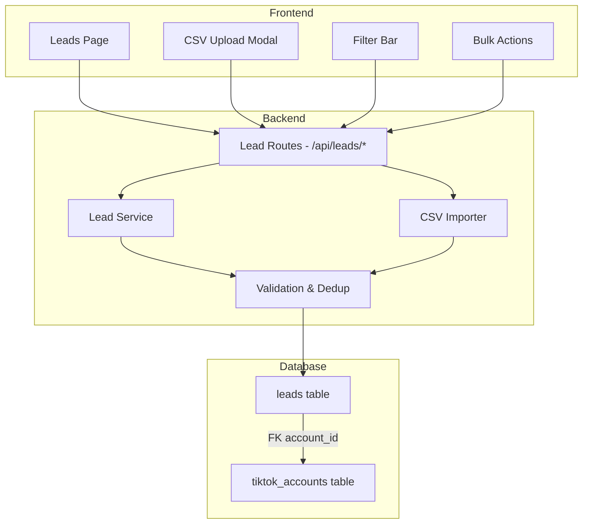
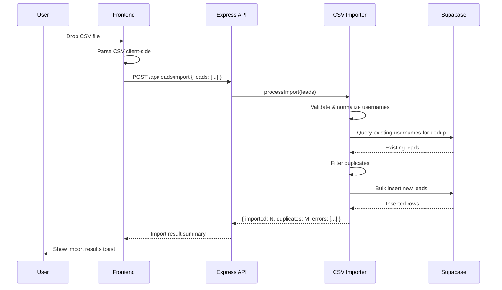
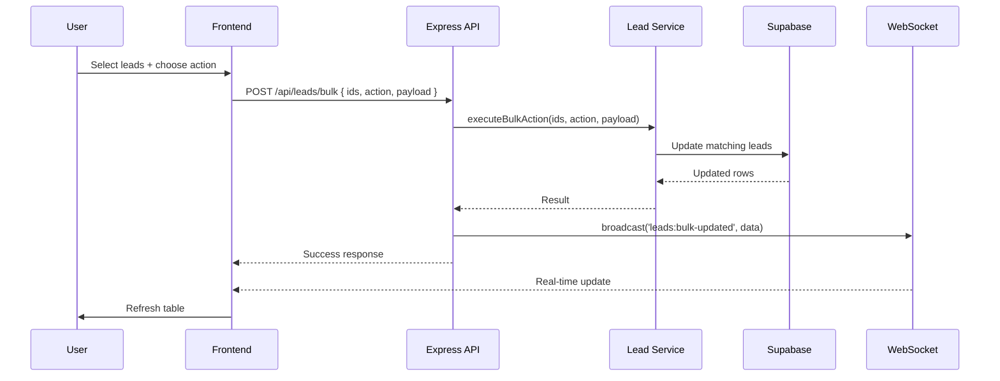

# Design Document: Lead Engine

## Overview

The Lead Engine is Phase 2 of the TokTik C2 platform, providing target list management for outreach campaigns. It introduces a `leads` table for storing TikTok usernames to target, with support for CSV bulk import, manual entry, flexible tagging, status tracking, and account assignment. The Lead Engine serves as the data foundation that Phase 3 (Campaign Engine) will consume to drive automated outreach sequences.

The system follows the same architectural patterns established in Phase 1: Express service modules for business logic, Supabase for persistence, REST API endpoints consumed by a React frontend, and WebSocket broadcasts for real-time UI updates.

## Architecture



## Sequence Diagrams

### CSV Import Flow



### Bulk Operations Flow



## Components and Interfaces

### Component 1: Lead Service (`server/services/lead-service.ts`)

**Purpose**: Core business logic for lead CRUD, querying, and bulk operations.

**Interface**:
```typescript
interface LeadService {
  listLeads(filters: LeadFilters): Promise<PaginatedResult<Lead>>
  getLead(id: string): Promise<Lead | null>
  createLead(input: CreateLeadInput): Promise<Lead>
  updateLead(id: string, fields: UpdateLeadInput): Promise<Lead>
  deleteLead(id: string): Promise<void>
  bulkAction(ids: string[], action: BulkAction): Promise<BulkResult>
  getStats(): Promise<LeadStats>
}
```

**Responsibilities**:
- CRUD operations on leads
- Pagination, filtering, and search
- Bulk operations (tag, assign, status change, delete)
- Statistics aggregation by status

### Component 2: CSV Importer (`server/services/csv-importer.ts`)

**Purpose**: Handles bulk import of leads from parsed CSV data with validation and deduplication.

**Interface**:
```typescript
interface CSVImporter {
  processImport(rows: CSVRow[], defaults?: ImportDefaults): Promise<ImportResult>
}
```

**Responsibilities**:
- Validate and normalize CSV row data
- Deduplicate against existing leads in the database
- Bulk insert valid leads
- Return detailed import results (imported count, duplicate count, error details)

### Component 3: Lead Routes (`server/index.ts` additions)

**Purpose**: Express route handlers exposing the Lead API.

**Responsibilities**:
- Request validation and parameter parsing
- Delegating to Lead Service and CSV Importer
- WebSocket broadcasts on mutations
- Error responses with appropriate HTTP status codes

### Component 4: Leads Page (`frontend/src/pages/Leads.tsx`)

**Purpose**: Main UI for viewing, filtering, searching, and managing leads.

**Responsibilities**:
- Table rendering with sortable columns
- Filter bar (status, tag, account, date range)
- Search by username
- Pagination controls
- Row selection and bulk action toolbar
- CSV upload modal trigger

### Component 5: CSV Upload Modal (`frontend/src/components/CSVUploadModal.tsx`)

**Purpose**: Drag-and-drop CSV file upload with preview and import execution.

**Responsibilities**:
- File drop zone with drag-and-drop support
- Client-side CSV parsing and preview
- Column mapping validation
- Import execution and result display

## Data Models

### Lead

```typescript
interface Lead {
  id: string                    // uuid
  account_id: string | null     // FK to tiktok_accounts, nullable
  username: string              // TikTok username (unique)
  display_name: string | null   // Optional display name
  source: string | null         // Where the lead came from (csv, manual, scraper)
  status: LeadStatus            // Current lead status
  tags: string[]                // Flexible tags array
  notes: string | null          // Free-text notes
  contacted_at: string | null   // When first outreach was sent
  replied_at: string | null     // When lead first replied
  created_at: string            // Row creation timestamp
}

type LeadStatus = 'new' | 'queued' | 'contacted' | 'replied' | 'converted' | 'do_not_contact'
```

**Validation Rules**:
- `username` must be non-empty, trimmed, lowercased, and unique across all leads
- `username` must match TikTok username format: alphanumeric, underscores, periods, 1-24 chars
- `status` must be one of the defined enum values
- `tags` elements must be non-empty trimmed strings
- `account_id` if provided must reference a valid tiktok_accounts row

### LeadFilters

```typescript
interface LeadFilters {
  status?: LeadStatus | LeadStatus[]
  tags?: string[]               // Filter leads that have ANY of these tags
  account_id?: string | null    // null = unassigned, string = specific account
  search?: string               // Username substring search
  created_after?: string        // ISO date
  created_before?: string       // ISO date
  page?: number                 // 1-indexed page number
  per_page?: number             // Default 50, max 100
}
```

### CreateLeadInput

```typescript
interface CreateLeadInput {
  username: string
  display_name?: string
  source?: string
  status?: LeadStatus           // Defaults to 'new'
  tags?: string[]
  notes?: string
  account_id?: string
}
```

### UpdateLeadInput

```typescript
interface UpdateLeadInput {
  display_name?: string
  source?: string
  status?: LeadStatus
  tags?: string[]
  notes?: string
  account_id?: string | null    // null to unassign
  contacted_at?: string
  replied_at?: string
}
```

### BulkAction

```typescript
type BulkAction =
  | { type: 'tag'; tags: string[] }
  | { type: 'untag'; tags: string[] }
  | { type: 'assign'; account_id: string | null }
  | { type: 'status'; status: LeadStatus }
  | { type: 'delete' }

interface BulkResult {
  affected: number
  ids: string[]
}
```

### ImportResult

```typescript
interface CSVRow {
  username: string
  tags?: string
  notes?: string
}

interface ImportDefaults {
  source?: string
  tags?: string[]
  status?: LeadStatus
}

interface ImportResult {
  imported: number
  duplicates: number
  errors: ImportError[]
  total: number
}

interface ImportError {
  row: number
  username: string
  reason: string
}
```

### PaginatedResult

```typescript
interface PaginatedResult<T> {
  data: T[]
  total: number
  page: number
  per_page: number
  total_pages: number
}
```

### LeadStats

```typescript
interface LeadStats {
  total: number
  by_status: Record<LeadStatus, number>
}
```

## Algorithmic Pseudocode

### CSV Import Algorithm

```typescript
async function processImport(rows: CSVRow[], defaults?: ImportDefaults): Promise<ImportResult> {
  // Precondition: rows is an array (may be empty)
  // Postcondition: returns ImportResult with imported + duplicates + errors.length === total

  const result: ImportResult = { imported: 0, duplicates: 0, errors: [], total: rows.length }

  // Step 1: Validate and normalize each row
  const validLeads: CreateLeadInput[] = []
  for (let i = 0; i < rows.length; i++) {
    const row = rows[i]
    const normalized = normalizeUsername(row.username)

    if (!normalized || !isValidUsername(normalized)) {
      result.errors.push({ row: i + 1, username: row.username || '', reason: 'Invalid username format' })
      continue
    }

    validLeads.push({
      username: normalized,
      tags: parseTags(row.tags, defaults?.tags),
      notes: row.notes || null,
      source: defaults?.source || 'csv',
      status: defaults?.status || 'new',
    })
  }

  // Step 2: Deduplicate against existing leads
  const usernames = validLeads.map(l => l.username)
  const existing = await queryExistingUsernames(usernames)
  const existingSet = new Set(existing)

  const newLeads = validLeads.filter(l => {
    if (existingSet.has(l.username)) {
      result.duplicates++
      return false
    }
    return true
  })

  // Step 3: Deduplicate within the batch itself
  const seenInBatch = new Set<string>()
  const uniqueNewLeads = newLeads.filter(l => {
    if (seenInBatch.has(l.username)) {
      result.duplicates++
      return false
    }
    seenInBatch.add(l.username)
    return true
  })

  // Step 4: Bulk insert
  if (uniqueNewLeads.length > 0) {
    await bulkInsertLeads(uniqueNewLeads)
    result.imported = uniqueNewLeads.length
  }

  // Postcondition check: imported + duplicates + errors.length === total
  return result
}
```

### Username Normalization

```typescript
function normalizeUsername(raw: string | undefined | null): string | null {
  // Precondition: raw may be any string or nullish
  // Postcondition: returns lowercase trimmed username without @ prefix, or null if empty

  if (!raw) return null
  let username = raw.trim().toLowerCase()
  if (username.startsWith('@')) username = username.slice(1)
  return username || null
}

function isValidUsername(username: string): boolean {
  // TikTok usernames: 1-24 chars, alphanumeric + underscores + periods
  return /^[a-z0-9_.]{1,24}$/.test(username)
}
```

### Pagination and Filtering

```typescript
async function listLeads(filters: LeadFilters): Promise<PaginatedResult<Lead>> {
  // Precondition: filters.page >= 1, filters.per_page in [1, 100]
  // Postcondition: result.data.length <= per_page, result.total_pages = ceil(total / per_page)

  const page = Math.max(1, filters.page || 1)
  const perPage = Math.min(100, Math.max(1, filters.per_page || 50))
  const offset = (page - 1) * perPage

  let query = supabase.from('leads').select('*', { count: 'exact' })

  // Apply filters
  if (filters.status) {
    const statuses = Array.isArray(filters.status) ? filters.status : [filters.status]
    query = query.in('status', statuses)
  }
  if (filters.tags && filters.tags.length > 0) {
    query = query.overlaps('tags', filters.tags)
  }
  if (filters.account_id !== undefined) {
    query = filters.account_id === null
      ? query.is('account_id', null)
      : query.eq('account_id', filters.account_id)
  }
  if (filters.search) {
    query = query.ilike('username', `%${filters.search}%`)
  }
  if (filters.created_after) {
    query = query.gte('created_at', filters.created_after)
  }
  if (filters.created_before) {
    query = query.lte('created_at', filters.created_before)
  }

  query = query.order('created_at', { ascending: false }).range(offset, offset + perPage - 1)

  const { data, count, error } = await query
  if (error) throw new Error(error.message)

  return {
    data: data as Lead[],
    total: count || 0,
    page,
    per_page: perPage,
    total_pages: Math.ceil((count || 0) / perPage),
  }
}
```

### Bulk Action Execution

```typescript
async function executeBulkAction(ids: string[], action: BulkAction): Promise<BulkResult> {
  // Precondition: ids is non-empty array of valid UUIDs
  // Postcondition: affected <= ids.length

  if (ids.length === 0) return { affected: 0, ids: [] }

  switch (action.type) {
    case 'delete': {
      const { error } = await supabase.from('leads').delete().in('id', ids)
      if (error) throw new Error(error.message)
      return { affected: ids.length, ids }
    }

    case 'status': {
      const { data, error } = await supabase
        .from('leads')
        .update({ status: action.status })
        .in('id', ids)
        .select('id')
      if (error) throw new Error(error.message)
      return { affected: data.length, ids: data.map(r => r.id) }
    }

    case 'assign': {
      const { data, error } = await supabase
        .from('leads')
        .update({ account_id: action.account_id })
        .in('id', ids)
        .select('id')
      if (error) throw new Error(error.message)
      return { affected: data.length, ids: data.map(r => r.id) }
    }

    case 'tag': {
      // Append tags using PostgreSQL array concatenation
      // For each lead, merge new tags with existing (deduplicated)
      const { data: leads } = await supabase.from('leads').select('id, tags').in('id', ids)
      const updates = (leads || []).map(lead => ({
        id: lead.id,
        tags: [...new Set([...lead.tags, ...action.tags])],
      }))
      for (const update of updates) {
        await supabase.from('leads').update({ tags: update.tags }).eq('id', update.id)
      }
      return { affected: updates.length, ids: updates.map(u => u.id) }
    }

    case 'untag': {
      const { data: leads } = await supabase.from('leads').select('id, tags').in('id', ids)
      const tagsToRemove = new Set(action.tags)
      const updates = (leads || []).map(lead => ({
        id: lead.id,
        tags: lead.tags.filter((t: string) => !tagsToRemove.has(t)),
      }))
      for (const update of updates) {
        await supabase.from('leads').update({ tags: update.tags }).eq('id', update.id)
      }
      return { affected: updates.length, ids: updates.map(u => u.id) }
    }
  }
}
```

## Key Functions with Formal Specifications

### `normalizeUsername(raw: string | null): string | null`

**Preconditions:**
- `raw` may be any string, null, or undefined

**Postconditions:**
- If raw is nullish or empty after trimming → returns null
- Otherwise returns lowercase string with leading `@` removed
- Result never contains leading/trailing whitespace
- Result never starts with `@`

### `isValidUsername(username: string): boolean`

**Preconditions:**
- `username` is a non-null string (already normalized)

**Postconditions:**
- Returns true if and only if username matches `^[a-z0-9_.]{1,24}$`
- No side effects

### `processImport(rows: CSVRow[], defaults?: ImportDefaults): Promise<ImportResult>`

**Preconditions:**
- `rows` is an array (may be empty)
- Each row has at least a `username` field

**Postconditions:**
- `result.imported + result.duplicates + result.errors.length === result.total`
- All imported leads have unique usernames in the database
- No duplicate usernames exist after import
- All imported leads have valid username format

**Loop Invariants:**
- After processing row i: `validLeads.length + errors.length === i + 1`
- After dedup: `newLeads.length + duplicates === validLeads.length`

### `listLeads(filters: LeadFilters): Promise<PaginatedResult<Lead>>`

**Preconditions:**
- `filters` is a valid LeadFilters object
- If `page` provided, it is >= 1
- If `per_page` provided, it is in [1, 100]

**Postconditions:**
- `result.data.length <= result.per_page`
- `result.total_pages === Math.ceil(result.total / result.per_page)`
- `result.page === requested page (clamped to >= 1)`
- All returned leads match the provided filters

### `executeBulkAction(ids: string[], action: BulkAction): Promise<BulkResult>`

**Preconditions:**
- `ids` is an array of valid UUID strings
- `action` is a valid BulkAction variant

**Postconditions:**
- `result.affected <= ids.length`
- For delete: all specified leads are removed from database
- For status: all specified leads have the new status
- For assign: all specified leads have the new account_id
- For tag: all specified leads have the new tags appended (no duplicates)
- For untag: all specified leads have the specified tags removed

## Example Usage

```typescript
// Create a single lead manually
const lead = await createLead({
  username: 'fitness_guru_2024',
  source: 'manual',
  tags: ['fitness', 'influencer'],
  notes: 'Found via hashtag #fitnesstips',
})

// Import leads from CSV
const csvRows: CSVRow[] = [
  { username: '@john_doe', tags: 'fitness,health', notes: 'Active poster' },
  { username: 'jane_smith', tags: 'beauty', notes: '' },
  { username: '', tags: '', notes: '' }, // Will be rejected
]
const result = await processImport(csvRows, { source: 'csv', tags: ['campaign-jan'] })
// result: { imported: 2, duplicates: 0, errors: [{ row: 3, username: '', reason: 'Invalid username format' }], total: 3 }

// List leads with filters
const page = await listLeads({
  status: ['new', 'queued'],
  tags: ['fitness'],
  search: 'guru',
  page: 1,
  per_page: 50,
})

// Bulk assign leads to an account
const bulkResult = await executeBulkAction(
  ['uuid-1', 'uuid-2', 'uuid-3'],
  { type: 'assign', account_id: 'account-uuid' }
)

// Get stats
const stats = await getStats()
// stats: { total: 150, by_status: { new: 80, queued: 30, contacted: 25, replied: 10, converted: 3, do_not_contact: 2 } }
```

## Error Handling

### Error Scenario 1: Duplicate Username on Create

**Condition**: User attempts to create a lead with a username that already exists
**Response**: Return 409 Conflict with message indicating the duplicate
**Recovery**: User can update the existing lead or choose a different username

### Error Scenario 2: Invalid CSV Data

**Condition**: CSV contains rows with invalid/empty usernames or malformed data
**Response**: Skip invalid rows, continue processing valid ones, return detailed error list
**Recovery**: User sees which rows failed and why, can fix and re-import

### Error Scenario 3: Invalid Account Assignment

**Condition**: User assigns a lead to an account_id that doesn't exist
**Response**: Return 400 Bad Request with message about invalid account
**Recovery**: User selects a valid account from the dropdown

### Error Scenario 4: Bulk Operation on Non-Existent Leads

**Condition**: Some IDs in a bulk operation don't exist (deleted between selection and action)
**Response**: Process all valid IDs, return affected count (may be less than requested)
**Recovery**: Frontend refreshes the table to reflect current state

## Testing Strategy

### Unit Testing Approach

- Test `normalizeUsername` with various inputs (whitespace, @-prefix, empty, unicode)
- Test `isValidUsername` with valid and invalid patterns
- Test filter building logic in `listLeads`
- Test bulk action logic for each action type
- Test CSV import with mixed valid/invalid/duplicate rows

### Property-Based Testing Approach

**Property Test Library**: fast-check

Property-based tests will validate:
- Username normalization idempotence
- Import accounting invariant (imported + duplicates + errors = total)
- Deduplication correctness
- Pagination bounds

### Integration Testing Approach

- Full API endpoint tests with Supabase test database
- CSV import end-to-end with various file sizes
- Bulk operations with concurrent modifications
- Filter combinations producing correct results

## Performance Considerations

- **Pagination**: All list queries are paginated (default 50, max 100) to prevent large result sets
- **Indexes**: GIN index on `tags` for array overlap queries, B-tree on `status` and `account_id` for filter performance
- **Bulk insert**: CSV imports use batch inserts rather than individual row inserts
- **Dedup query**: Single query to check all usernames in a batch rather than per-row lookups
- **Client-side CSV parsing**: Parse CSV in the browser to avoid sending raw file data to the server

## Security Considerations

- **Input sanitization**: All usernames are normalized and validated against a strict regex before storage
- **SQL injection prevention**: All queries use Supabase's parameterized query builder
- **CSV size limits**: Enforce maximum row count (10,000) and file size limits on import
- **Auth middleware**: All lead endpoints require the same bearer token auth as existing endpoints
- **Rate limiting**: Bulk operations limited to 500 IDs per request

## Dependencies

- **Existing**: Supabase client (`@supabase/supabase-js`), Express, WebSocket (`ws`)
- **New frontend**: None (CSV parsing done with native FileReader + string splitting)
- **No new backend dependencies**: CSV parsing is simple enough to handle without a library (split by newline, split by comma, handle quoted fields)

## Correctness Properties

*A property is a characteristic or behavior that should hold true across all valid executions of a system — essentially, a formal statement about what the system should do. Properties serve as the bridge between human-readable specifications and machine-verifiable correctness guarantees.*

### Property 1: Username normalization idempotence

*For any* valid username string, normalizing it once produces the same result as normalizing it twice: `normalizeUsername(normalizeUsername(x)) === normalizeUsername(x)`

**Validates: Requirements 2.1**

### Property 2: Import accounting invariant

*For any* array of CSV rows, after import processing: `result.imported + result.duplicates + result.errors.length === result.total`

**Validates: Requirements 3.5**

### Property 3: Deduplication correctness

*For any* set of CSV rows containing duplicate usernames (after normalization), the import process shall never insert two leads with the same username, and the total imported count plus duplicate count equals the number of valid rows.

**Validates: Requirements 3.3, 3.4**

### Property 4: Pagination bounds

*For any* valid page and per_page parameters, the returned data length is at most per_page, and `total_pages === Math.ceil(total / per_page)`.

**Validates: Requirements 4.1, 4.7**

### Property 5: Bulk tag append preserves existing tags

*For any* lead with existing tags and any set of new tags to add, after a bulk tag operation, the lead's tags contain all original tags plus all new tags with no duplicates.

**Validates: Requirements 6.1**

### Property 6: Username validation rejects invalid characters

*For any* string containing characters outside `[a-z0-9_.]` or with length outside [1, 24], `isValidUsername` returns false.

**Validates: Requirements 2.2**

### Property 7: Statistics sum invariant

*For any* set of leads in the database, the sum of all values in `by_status` equals `total`.

**Validates: Requirements 7.1**
